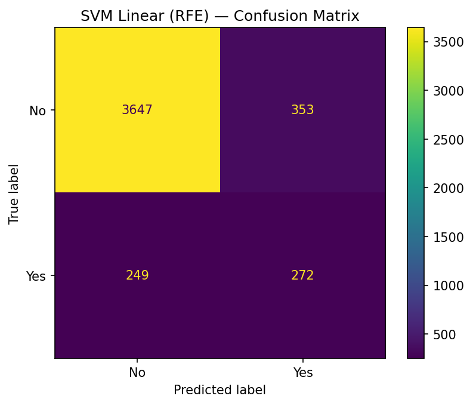
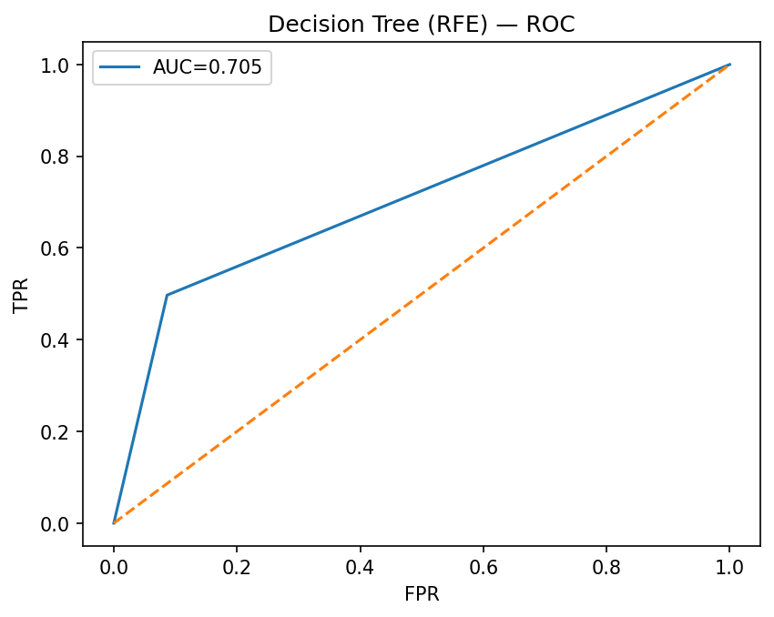
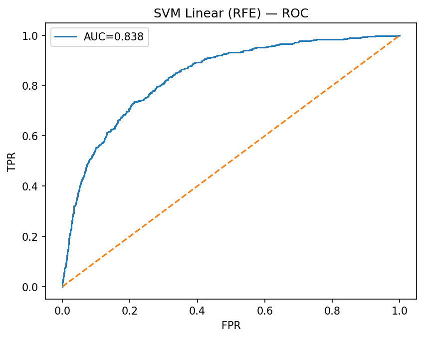
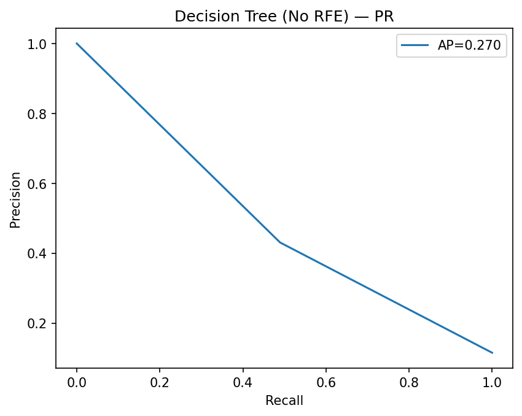
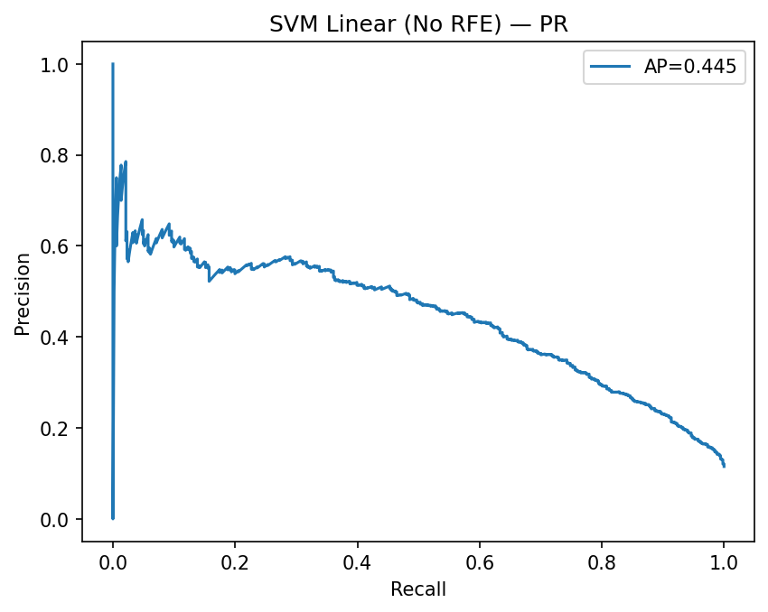
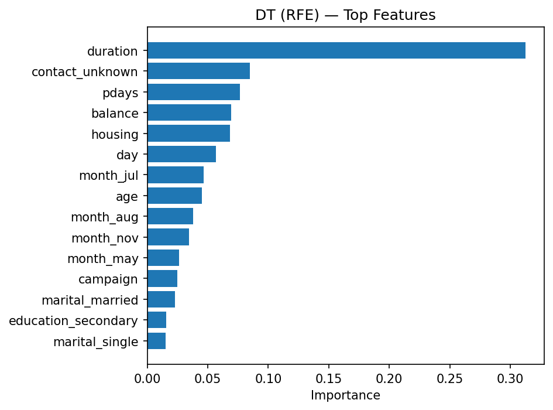
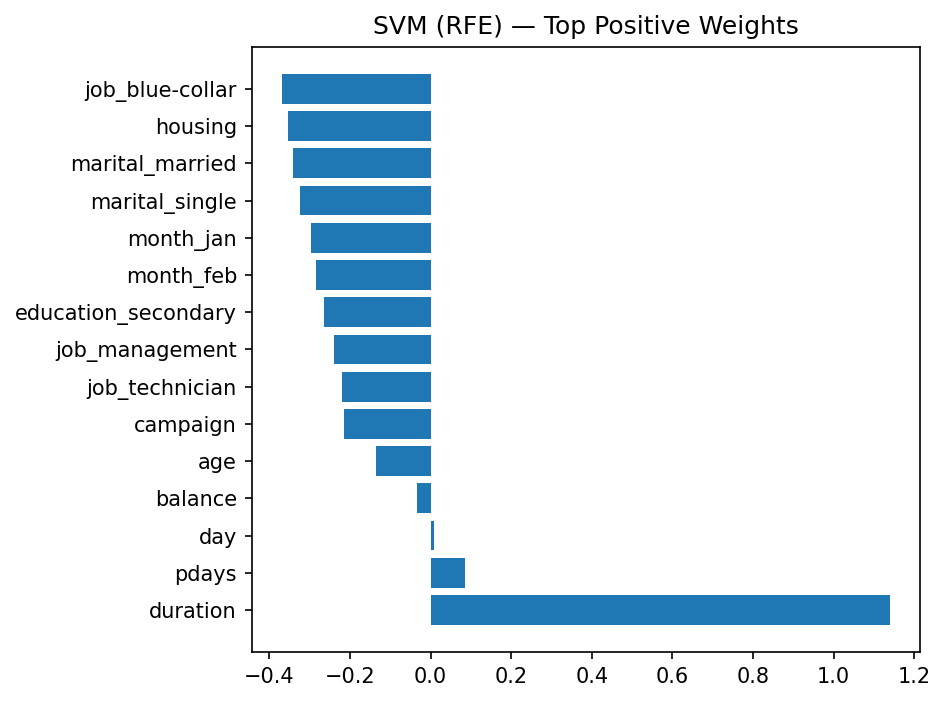

````markdown
# Bank Marketing Campaign Prediction

## 📌 Overview
This project applies **Supervised Machine Learning** techniques to the **UCI Bank Marketing Dataset** to predict whether a client will subscribe to a term deposit.  
The dataset is imbalanced (~11.5% positive cases), so advanced preprocessing and evaluation strategies were applied to improve model performance.

## 📊 Dataset
- **Source**: [UCI Repository](https://archive.ics.uci.edu/dataset/222/bank+marketing)  
- **Samples**: 4,521  
- **Features**: 17 (demographic, economic, and campaign-related)  
- **Target**: Subscribe (Yes/No)

## ⚙️ Preprocessing
- Label & One-Hot Encoding for categorical variables  
- **SMOTE** to handle class imbalance (~88.5% "No" vs 11.5% "Yes")  
- Feature Scaling (for SVM)  
- **Recursive Feature Elimination (RFE)** for feature selection  

## 🤖 Models (Supervised Learning)
Two supervised classifiers were implemented:
- **Decision Tree (DT)** – interpretable, rule-based approach  
- **Support Vector Machine (SVM, linear kernel)** – effective for high-dimensional data  

## 📈 Results
Evaluation was done using **Stratified 10-Fold Cross-Validation** with **F1-score** as the main metric (due to class imbalance).  

- **Decision Tree (DT)**: F1 ≈ 0.46, Accuracy ≈ 87%  
- **SVM (Linear Kernel)**: F1 ≈ 0.47, Accuracy ≈ 89%  
- RFE improved both models slightly by focusing on the most important features  

👉 **SVM consistently outperformed Decision Tree in F1-score, while Decision Tree remained more interpretable.**

### Example Visuals
Confusion Matrices:  
  
  

ROC Curves:  
  
  

Precision–Recall Curves:  
  
  

Feature Importances:  
  
  

## 🛠️ Dependencies
To run this project, install the following Python libraries:
- pandas  
- numpy  
- scikit-learn  
- imbalanced-learn  
- matplotlib  
- seaborn  

## ▶️ How to Run
1. Clone this repo:
   ```bash
   git clone https://github.com/ihabiba/BankMarketing-ML
````

2. Install dependencies:

   ```bash
   pip install pandas numpy scikit-learn imbalanced-learn matplotlib seaborn
   ```

## 💡 Business Insights

* SVM is more effective at detecting potential subscribers, meaning banks could reduce wasted campaign costs by focusing on customers flagged by the SVM model.
* Decision Trees remain valuable for interpretability — marketing managers can understand why certain customers are more likely to subscribe (e.g., call duration, previous campaign outcome).
* Call duration and previous campaign results emerged as key predictors of subscription — longer calls and positive past responses increase the likelihood of success.
* Balancing the dataset (via SMOTE) was critical; without it, models heavily favored predicting "No" and ignored potential subscribers.
* Actionable takeaway: Banks can combine predictive models (SVM for performance, DT for explainability) to target the right customers while understanding customer behavior drivers.

## 📌 Key Insight

This project demonstrates how supervised learning, combined with proper preprocessing and evaluation, can help financial institutions optimize marketing campaigns, reduce costs, and improve conversion rates.

```
